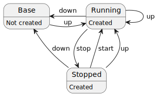

# PmRails

PmRails is a toolset for testing and developing Ruby on Rails applications
without installing Rails or its dependencies on your local machine.
It leverages [Podman](https://docs.podman.io/en/latest/)
to create an isolated, containerized environment for your Rails projects.


## Why Use PmRails?

- **Clean Local Environment**: No need to install Rails or dependencies locally.
- **Quick Setup**: Start developing immediately once Podman is installed.
- **Consistent and Reproducible Environments**: Isolated containers prevent dependency conflicts, making it ideal for team collaboration.
- **Experiment Freely**: Safely test different Rails versions or configurations.


## Features

PmRails provides the following commands:

- **`pmrails-new`**: Creates a new Rails application as a wrapper around `rails new`.\
  **Usage**: `pmrails-new RAILS_VERSION APP_PATH [OPTIONS]`

- **`pmrails-new-plus`**: Performs the typical setup tasks for developing a new Rails application with PmRails in a single step.\
  **Usage**: `pmrails-new-plus RAILS_VERSION APP_PATH [OPTIONS]`

- **`pmrails-init`**: Generates a standard set of PmRails configuration files for an existing Rails application.\
  **Usage**: `pmrails-init [OPTIONS]`

- **`pmrails-run`**: Runs an arbitrary command inside a single Rails container with project-local runtime directories.\
  **Usage**: `pmrails-run COMMAND [OPTIONS]`

- **`pmrails-compose`**: Wraps `podman-compose` to operate the project's Compose environment.\
  **Usage**: `pmrails-compose [GLOBAL_OPTIONS] COMMAND [COMMAND_OPTIONS]`

### Deprecated Commands

The following legacy commands are kept for backward compatibility and will be removed in a future release:

- `pmrails` → use `pmrails-run bin/rails` instead.
- `pmbundle` → use `pmrails-run bundle` instead.
- `pmrailsenvexec` → use `pmrails-run` instead.


## Installation

### Prerequisites

You must have Podman installed.
Follow the [Podman Installation Instructions](https://podman.io/docs/installation) for your operating system.

**If you plan to use `pmrails-compose` (Mode 3), you also need `podman-compose`.**

> **Important:** You must install a recent version of `podman-compose` from PyPI. The versions provided by default OS package managers (such as `apt`) are often too old and may not work correctly with PmRails. We highly recommend using [`pipx`](https://pipx.pypa.io/stable/how-to/install-pipx/) for the installation.

Example installation on Ubuntu/Debian using `pipx`:

```sh
# Install pipx
sudo apt update
sudo apt install pipx
pipx ensurepath

# Reload your shell to apply PATH changes
exec $SHELL -l

# Install the latest podman-compose from PyPI
pipx install podman-compose
```

On other operating systems, install `pipx` by following the [official pipx installation guide](https://pipx.pypa.io/stable/how-to/install-pipx/), and then run `pipx install podman-compose`. For more details, see the [podman-compose repository](https://github.com/containers/podman-compose).

### Install PmRails

Download PmRails to your preferred location. For example:

```sh
mkdir -p ~/.var
cd ~/.var
git clone https://github.com/wakairo/pmrails.git
```

Add the `bin` directory to your system's PATH environment variable. For example, using bash:

```sh
echo 'export PATH="$HOME/.var/pmrails/bin:$PATH"' >> ~/.bashrc
exec $SHELL -l
```

### (Optional) Set Up Aliases

PmRails ships with a small `aliases` file that defines shorthand aliases for the most common invocations.
Sourcing it lets you replace long commands like:

```sh
pmrails-compose exec rails-app bin/rails console
```

with shorter ones like:

```sh
pmrails-crails console
```

To install the aliases, append the file to your shell's startup script and reload the shell. For bash:

```sh
cat ~/.var/pmrails/aliases >> ~/.bashrc
exec $SHELL -l
```

This adds the following aliases:

```sh
# pmrails aliases
alias pmrails-rrails='pmrails-run bin/rails'
alias pmrails-crails='pmrails-compose exec rails-app bin/rails'
alias pmrails-cmpexe='pmrails-compose exec rails-app'
```


## Usage

PmRails has three primary modes:

1. **Create a new Rails application only** — runs `rails new` inside a container.
2. **Create and develop with a single Rails container** — uses a managed gem store, then runs day-to-day Rails commands with `pmrails-run`.
3. **Create and develop with Compose** — uses the same managed gem store, then uses `.pmrails/compose.yaml` and `pmrails-compose` to operate a multi-container environment (Rails + database + Selenium, etc.).

These modes share the same building blocks and can be combined freely:

- A custom Rails container image (`.pmrails/Dockerfile`) can be used with or without a multi-container setup.
- A multi-container setup (`.pmrails/compose.yaml`) can be used with or without a custom image.
- `pmrails-init` generates both `Dockerfile` and `compose.yaml`, but you can keep only what you need.

### Rails Version Requirement for New Apps

Both `pmrails-new` and `pmrails-new-plus` install Rails from RubyGems and then run `rails new`.
A plain numeric version such as `8.1` expands to `'~> 8.1.0'`, meaning the latest compatible Rails 8.1.x release is installed to generate the application.
To opt out, pass an explicit RubyGems requirement, such as `'= 8.1.0'` to pin an exact version.

### 1. Create a New Rails Application Only

Use this mode when you only want to generate the application files and intend to run the application in another environment.
`pmrails-new` is a thin wrapper around `rails new`; it behaves almost the same as `rails new`.

Navigate to a temporary directory. For example:

```sh
mkdir -p ~/tmp
cd ~/tmp
```

Create a new Rails application, specifying the Rails version and any `rails new` options you need. For example:

```sh
pmrails-new 8.1 new_app --database=postgresql
```

> **Note:** Numeric versions like `8.1` expand to `'~> 8.1.0'`. To pin the exact version, use `'= 8.1.0'` (see [details](#rails-version-requirement-for-new-apps)).

### 2. Create and Develop with a Single Rails Container

Use this mode when you plan to continue developing the application with PmRails using a single container that runs Rails directly.
Gems are installed inside a PmRails-managed container environment, so the application can be developed without relying on the host Ruby environment.

> **Note:** This section shows development with **SQLite**. However, you can use external databases (PostgreSQL, MySQL, etc.) by configuring your application — see **Using an External Database** below for examples.

#### Create a New Rails Application Using `pmrails-new-plus`

Navigate to a temporary directory. For example:

```sh
mkdir -p ~/tmp
cd ~/tmp
```

Create a new Rails application with `pmrails-new-plus`:

```sh
pmrails-new-plus 8.1 sample_app
```

> **Note:** Numeric versions like `8.1` expand to `'~> 8.1.0'`. To pin the exact version, use `'= 8.1.0'` (see [details](#rails-version-requirement-for-new-apps)).

When using this command, any `rails new` options can be specified after the application name.

`pmrails-new-plus` automatically performs the following tasks:

- Creates a new Rails application
- Installs gems in the managed PmRails gem store
- Adds `/.pmrails/var/` and `/.pmrails/config.local` to `.gitignore`

#### Run Rails Commands

Navigate to the application directory:

```sh
cd sample_app
```

Use `pmrails-run` to run Rails commands. For example, to start the server:

```sh
pmrails-run bin/rails server -b 0.0.0.0
```

Then, open your web browser and navigate to `http://localhost:3000/`.

#### More Examples

```sh
# Run Bundler to install gems
pmrails-run bundle install

# Run database migrations
pmrails-run bin/rails db:migrate
# Or, with the alias:
pmrails-rrails db:migrate

# Open the Rails console
pmrails-run bin/rails console
# Or, with the alias:
pmrails-rrails console
```

> **Tip:** You can add a `.pmrails/Dockerfile` to customize the Rails container image used in this mode. Compose is not required to take advantage of a custom image — see [Custom Rails Container Image](#custom-rails-container-image).

### 3. Create and Develop with Compose

Use this mode when you want PmRails to spin up Rails together with a database, a Selenium browser, or other services as separate containers.
Gems use the same managed PmRails gem store as `pmrails-run`, so the host Ruby environment stays untouched.

In this mode, think of the Compose environment as a long-lived workspace, not a one-shot container.
You usually bring it up once, run many `exec` commands while it is running, stop it when you want to pause, start it again when you return, and finally tear it down when you are done.

One important rule follows from that model: once you are working with Compose, run your day-to-day Rails commands through `pmrails-compose exec rails-app ...`, not `pmrails-run`.
`pmrails-run` starts an isolated container and cannot talk to the database, Selenium, or other services managed by Compose.

#### Prepare the Project

First, create a new Rails application. For example:

```sh
mkdir -p ~/tmp
cd ~/tmp
pmrails-new-plus 8.1 sample_app --database=postgresql
```

> **Note:** Numeric versions like `8.1` expand to `'~> 8.1.0'`. To pin the exact version, use `'= 8.1.0'` (see [details](#rails-version-requirement-for-new-apps)).

Then move into the new application directory and generate the PmRails setting files:

```sh
cd sample_app
pmrails-init --database=postgresql
```

When `--database` is given, `pmrails-init` writes a `compose.yaml` that includes a matching database service.
Supported values are `sqlite3` (default), `postgresql`, `mysql`, `trilogy`, `mariadb-mysql`, and `mariadb-trilogy`.

`pmrails-init` creates `.pmrails/config`, `.pmrails/Dockerfile`, and `.pmrails/compose.yaml`.
These files can be used independently or together — see [Configuration](#configuration) for details.
It also patches `test/application_system_test_case.rb` (when present) so that system tests can drive the Selenium container provided by Compose.

> **Tip:** `pmrails-init` is safe to run multiple times. If configuration files already exist, it preserves your custom edits and writes the newly generated versions to files with a `.pmrails-init` suffix instead.

> **Tip:** A `.pmrails/Dockerfile` is optional in this mode as well. If you only have a `.pmrails/compose.yaml`, PmRails uses an upstream `ruby` image instead of building a project-specific image.

#### Run the Environment Day to Day

The usual workflow is:

1. Bring the environment up with `pmrails-compose up -d`.
2. Do your work with `pmrails-compose exec rails-app ...` while it is running.
3. Pause it with `pmrails-compose stop` when you want to come back later.
4. Resume it with `pmrails-compose start`.
5. Remove it with `pmrails-compose down` when you are done.

Start with:

```sh
pmrails-compose up -d
```

Use `up` the first time you use the project, after changing `.pmrails/compose.yaml`, or whenever you are unsure what state the environment is in.
If the services do not exist yet, `up` creates them. If they already exist but are stopped, `up` starts them again.

Once the environment is running, do your work with `exec`:

```sh
pmrails-compose exec rails-app bundle install
pmrails-compose exec rails-app bin/rails db:migrate
pmrails-compose exec rails-app bin/rails console
pmrails-compose exec rails-app bin/rails server
```

If you use the aliases, the same commands become:

```sh
pmrails-cmpexe bundle install
pmrails-crails db:migrate
pmrails-crails console
pmrails-crails server
```

If you start the Rails server, open `http://localhost:3000/` in your browser.

When you want to pause work without deleting the environment, run:

```sh
pmrails-compose stop
```

When you return, resume that stopped environment with:

```sh
pmrails-compose start
```

Use `start` when you simply want to continue a previously stopped environment as-is.
If you changed `.pmrails/compose.yaml`, use `pmrails-compose up -d` instead so Compose can reconcile the environment with the current configuration.

When you are truly finished and want to remove the Compose-managed containers and network, run:

```sh
pmrails-compose down
```

Named volumes are kept by default, so database data is preserved across normal `down` / `up` cycles.
To remove the volumes too and fully wipe the database data, run:

```sh
pmrails-compose down -v
```

#### Reference: Compose State Transitions

The following diagram shows the basic lifecycle of a Compose environment:



Practical points:

- `up` is the general-purpose "make it match the current configuration" command. It brings the environment to **Running** from either **Base (Not created)** or **Stopped**, and is also safe to run when the environment is already **Running**.
- `start` is narrower: it only resumes an already-created stopped environment and never recreates it from scratch. When the configuration has not changed, pairing `stop` with `start` is the fastest way to pause and resume work, since `stop` leaves containers in place rather than deleting them.
- `down` tears the environment back down to **Base (Not created)** by removing the Compose-managed containers and network. Named volumes survive unless you also pass `-v`, so database data is preserved across a normal teardown.


## Configuration

PmRails is configured through a combination of:

1. **Configuration files** — `config` files at multiple scopes.
2. **Environment variables set by the caller** — override anything set by configuration files.
3. **A custom `Dockerfile`** at `.pmrails/Dockerfile` (optional) — controls the Rails container image.
4. **A custom `compose.yaml`** at `.pmrails/compose.yaml` (optional) — describes the multi-container environment.

### Configuration Files

PmRails sources configuration files from four scopes. Files that do not exist or are unreadable are silently skipped, and later scopes override earlier ones:

| Scope         | Path                                                      | Typical Use                                              |
| ------------- | --------------------------------------------------------- | -------------------------------------------------------- |
| System        | `/etc/pmrails/config` (override path: `PMRAILS_SYS_CONF`) | Defaults set by a system administrator.                  |
| User          | `${XDG_CONFIG_HOME:-${HOME}/.config}/pmrails/config`      | Defaults specific to your user account on this machine.  |
| Project       | `./.pmrails/config`                                       | Project-shared settings (commit this file).              |
| Project-local | `./.pmrails/config.local`                                 | Per-developer overrides for this project (gitignored).   |

> **Tip:** To use a system config path other than `/etc/pmrails/config`, set the `PMRAILS_SYS_CONF` environment variable (for example, `export PMRAILS_SYS_CONF="/usr/local/etc/pmrails/config"`). This is useful on hosts where `/etc/` is read-only or unavailable, such as some immutable distributions.

> **Note:** `pmrails-new-plus` adds both `/.pmrails/var/` and `/.pmrails/config.local` to the project's `.gitignore`, so project-local overrides are not committed.

#### File Format

Each file is a POSIX shell script that is sourced by the PmRails entry point. Most commonly, you set `PMRAILS_*` variables. For example:

```sh
# .pmrails/config
PMRAILS_PORTS="3000:3000 5000:5000"
PMRAILS_RUBY_VERSION_AT_NEW="3.4.8"
```

> **Warning:** Configuration files are sourced directly in the current shell. Only place trusted content, such as variable settings, in them.

### Configuration Environment Variables

The variables below can be set in a configuration file, exported in your shell, or passed inline before a `pmrails-*` command (for example: `PMRAILS_PORTS=8080:3000 pmrails-run bin/rails server -b 0.0.0.0`).

#### `:AUTO`

Set a configuration variable to `:AUTO` to make PmRails treat it as unset, so the usual automatic resolution or default value applies. This is useful when a broader config sets a fixed value but one project should return to automatic behavior.

An empty string is different: `FOO=""` explicitly sets an empty string, while `FOO=":AUTO"` makes PmRails treat the setting as unset.

`PMRAILS_SYS_CONF` is the exception and does not support `:AUTO`, because it controls where configuration is loaded from.

Values beginning with `:` are reserved; currently only `:AUTO` is valid, and other reserved values cause an error.

#### `PMRAILS_RUBY_VERSION`

Selects the Ruby version used by `pmrails-run` and `pmrails-compose`. When unset, PmRails reads the version from `.ruby-version` in the project root; see [Ruby Version Resolution](#ruby-version-resolution) for the precise rules.

```sh
PMRAILS_RUBY_VERSION="3.3.7"
```

#### `PMRAILS_RUBY_VERSION_SUFFIX`

Appends an optional suffix fragment to the Ruby image tag used by `pmrails-run` and `pmrails-compose`. The value must be empty or include its leading separator, such as `-bookworm` or `-slim-bookworm`.

```sh
PMRAILS_RUBY_VERSION_SUFFIX="-bookworm"
```

For example, `PMRAILS_RUBY_VERSION="3.3.7"` with `PMRAILS_RUBY_VERSION_SUFFIX="-bookworm"` selects `ruby:3.3.7-bookworm`. The default is an empty suffix.

#### `PMRAILS_RUBY_VERSION_AT_NEW`

Selects the Ruby version used to **generate** new Rails applications (`pmrails-new` and `pmrails-new-plus`). Defaults to `latest`. Use this to pin the generation environment to a specific Ruby release rather than relying on `latest`:

```sh
# Generate a new Rails 8.1 application using Ruby 3.4.8 instead of `latest`
PMRAILS_RUBY_VERSION_AT_NEW=3.4.8 pmrails-new-plus 8.1 sample_app
```

> **Note:** To ensure maximum stability during project generation, these commands always use the official upstream `ruby` image and intentionally ignore `PMRAILS_RUBY_VERSION_SUFFIX`.

#### `PMRAILS_PORTS`

Configures the port mappings published by `pmrails-run`, and by the `rails-app` service in `pmrails-compose`. Each token is either `HOST_PORT:CONTAINER_PORT` or `CONTAINER_PORT` alone; multiple mappings are separated by spaces. When only a container port is given, the host port is auto-allocated by Podman; check the assigned port with `podman port <container>`.

**Default:**

```sh
PMRAILS_PORTS="3000:3000"
```

**Examples (used inline before a command):**

```sh
# Publish container port 3000 on host port 3001
PMRAILS_PORTS="3001:3000" pmrails-run bin/rails server -b 0.0.0.0

# Run a one-shot command without publishing any ports (useful for analyzers
# and other CLI tools that do not need to expose listening ports to the host)
PMRAILS_PORTS= pmrails-run bin/brakeman

# Publish multiple ports / port ranges
PMRAILS_PORTS="3000:3000 1234-1236:1234-1236" pmrails-run bin/rails server -b 0.0.0.0
```

#### `PMRAILS_PROJECT_NAME`

Overrides the project name. PmRails uses it as the `podman-compose` project name (`-p` flag) and as part of the project-specific image repository name. When unset, PmRails derives it from the basename of the current directory (lowercased, sanitized to lowercase alphanumerics and underscores, truncated to 16 characters).

```sh
PMRAILS_PROJECT_NAME="sample_app"
```

#### `PMRAILS_DOCKERFILE`

Path to the project Dockerfile. Defaults to `.pmrails/Dockerfile`. When the file exists, `pmrails-run` and `pmrails-compose` build and use a project-specific image (`pmrails-${PMRAILS_PROJECT_NAME}`); when it does not, an upstream `ruby` image is used directly. See [Custom Rails Container Image](#custom-rails-container-image).

#### `PMRAILS_COMPOSE_FILE`

Path to the project Compose configuration file. Defaults to `.pmrails/compose.yaml`. `pmrails-compose` requires this file to exist and exits with an error otherwise.

#### `PMRAILS_GEM_HOME_ABI`

Overrides the ABI suffix used for the shared `GEM_HOME` volume name.
This serves as an escape hatch for complex native-extension compatibility scenarios.
Most users should leave this unset.
For details, see [Automatic Gem Sharing](#automatic-gem-sharing).

### Custom Rails Container Image

If `.pmrails/Dockerfile` exists, `pmrails-run` (and the `rails-app` service in `pmrails-compose`) builds and uses a project-specific image named `pmrails-${PMRAILS_PROJECT_NAME}:${PMRAILS_RUBY_VERSION}${PMRAILS_RUBY_VERSION_SUFFIX}` instead of the upstream `ruby` image. This lets you preinstall system packages, native build tools, or other dependencies that your Rails application needs.

`pmrails-init` generates a sensible Dockerfile that matches the database engine selected via `--database`. The generated Dockerfile receives both `PMRAILS_RUBY_VERSION` and `PMRAILS_RUBY_VERSION_SUFFIX` as build arguments and uses them in `FROM ruby:${PMRAILS_RUBY_VERSION}${PMRAILS_RUBY_VERSION_SUFFIX}`. You can also write your own from scratch.

A custom Dockerfile is optional in both Mode 2 and Mode 3. In Mode 2 it lets you customize the single Rails container without Compose.

### Custom Compose Configuration

If `.pmrails/compose.yaml` exists, `pmrails-compose` layers it on top of an internal base file and an auto-generated overlay (which carries the `PMRAILS_PORTS` mapping for the `rails-app` service). The merge order, with later files overriding earlier ones, is:

1. PmRails-internal base (`share/compose.base.yaml`).
2. Auto-generated overlay.
3. Your `.pmrails/compose.yaml`.

`pmrails-init` generates a `compose.yaml` that includes a service for the chosen database (SQLite3 needs none) and a Selenium service for system tests. You can edit this file freely or replace it entirely.

> **Important:** When modifying or replacing this file, **you must use `rails-app` as the service name for your Rails container**. PmRails internal commands and auto-generated configurations explicitly rely on this exact service name to function correctly.

> **Note:** Completely overriding the `volumes`, `environment`, or `entrypoint` settings of the `rails-app` service (rather than appending to them) will break automatic gem sharing. If you need to customize these, review `share/compose.base.yaml` to ensure you preserve the required PmRails internal mappings.

## `.pmrails` — Local Directory and In-Container Environment Variables

PmRails keeps project-specific runtime files such as caches, configs, and state
inside a project-local directory named `.pmrails/var/`.
Installed gems are managed separately in Podman named volumes; see [Automatic Gem Sharing](#automatic-gem-sharing).
PmRails sets environment variables to direct the containerized process to use these paths.
This design keeps your host user account clean while keeping project-local state easy to reset.

The following table shows how environment variables are mapped to project-local directories:

| Environment Variable (Container) |  Project Path (Repo Root) | Purpose                                            |
| -------------------------------- | ------------------------: | -------------------------------------------------- |
| `HOME`                           |       `.pmrails/var/home` | Process HOME — where tools write dotfiles          |
| `XDG_CACHE_HOME`                 |      `.pmrails/var/cache` | Tool caches                                        |
| `XDG_CONFIG_HOME`                |     `.pmrails/var/config` | Per-user configuration files                       |
| `XDG_DATA_HOME`                  |      `.pmrails/var/share` | Optional data files used by some tools             |
| `XDG_STATE_HOME`                 |      `.pmrails/var/state` | Optional state files used by some tools            |

### Benefits of this Design

- **Cleanliness:** Keeps the host user's `~/.gem`, `~/.bundle`, and other personal files untouched.
- **Isolation:** Makes project state local and easy to reset.

### Managing the `.pmrails` Directory

- **Git:** Do not commit `.pmrails/var/` to source control. `pmrails-new-plus` adds it to `.gitignore` automatically.
- **Reset:** `.pmrails/var/` is safe to remove. If you encounter issues with project-local caches, configs, or state, run `rm -rf .pmrails/var` and then rerun your usual PmRails command.
- **Security:** In multi-user environments, ensure `.pmrails/` is readable only by your user (e.g., `chmod -R go-rwx .pmrails`), as it may contain credentials or cached data.


## Automatic Gem Sharing

PmRails automatically stores installed gems in Podman named volumes mounted as `GEM_HOME`.
In normal use, you do not need to manage this yourself: repeated `bundle install` runs can be faster, and compatible projects avoid storing duplicate gem copies.

Installed gems are reused when both of these match:

1. The resolved Ruby version.
2. The `GEM_HOME` Application Binary Interface (ABI) suffix.

Volumes without an ABI suffix, such as `pmrails-gem_home-3.4.8`, use the official Ruby image ABI. If you consistently use official Ruby images, this should work automatically.

When mixing different images or host platforms, the core rule is: **the same ABI suffix must guarantee native-extension compatibility.** 

If `PMRAILS_GEM_HOME_ABI` is unset, PmRails automatically derives the ABI suffix from the image tag. It removes a leading numeric Ruby-version prefix and one optional following `-`, while leaving other text in place to avoid merging incompatible gem stores too aggressively. For example, `3.4.8-trixie` becomes `trixie`.

This means setting `PMRAILS_RUBY_VERSION_SUFFIX="-bookworm"` normally also gives the shared `GEM_HOME` volume the ABI suffix `bookworm`.

If this automatic derivation is incorrect for your use case, or if you need to manually split or merge gem stores, override it in a config file:

```sh
# .pmrails/config

# Use a specific ABI suffix.
PMRAILS_GEM_HOME_ABI="alpine3.22"

# Or use the suffixless official Ruby image ABI volume.
PMRAILS_GEM_HOME_ABI=""
```

Use `podman volume` to manage these gem stores. List them with `podman volume ls`; to reset one, remove its volume:

```sh
podman volume rm pmrails-gem_home-3.4.8-trixie
```

If the official Ruby image ABI changes for a Ruby version you already use, remove the suffixless volume for that Ruby version so gems with native extensions will be rebuilt.


## Ruby Version Resolution

PmRails determines which Ruby version to use based on the presence and content
of a `.ruby-version` file in the current directory.

### Commands That Read `.ruby-version`

The following commands read `.ruby-version` to determine the Ruby version:

- `pmrails-run`
- `pmrails-compose`

(`pmrails-new` and `pmrails-new-plus` use `PMRAILS_RUBY_VERSION_AT_NEW` instead, since the project being generated does not yet have a `.ruby-version`.)

### Behavior When `.ruby-version` Is Present or Absent

- **When `.ruby-version` exists:**
  PmRails extracts a Ruby version from the first line of the file and uses the corresponding container image.

- **When `.ruby-version` does not exist:**
  PmRails defaults to `latest` as the Ruby-version part of the image tag.

### Accepted `.ruby-version` Format

PmRails looks for a `MAJOR.MINOR.PATCH` pattern
on the **first line** of `.ruby-version`
and uses the first match found.

Accepted examples:

- `3.2.2`
- `ruby-4.0.1` (the numeric `4.0.1` part is extracted)

If no `MAJOR.MINOR.PATCH` sequence is found on the first line,
the command exits with an error.
This design choice ensures unambiguous and reproducible container image selection.

### Relationship to Container Images

The value read from `.ruby-version` is used as the Ruby-version part of the container image tag. PmRails then appends `PMRAILS_RUBY_VERSION_SUFFIX`, if set:

> `ruby:<major.minor.patch><PMRAILS_RUBY_VERSION_SUFFIX>`

For example, with the default empty suffix:

> `.ruby-version`: `3.2.2` -> `ruby:3.2.2`

With `PMRAILS_RUBY_VERSION_SUFFIX="-bookworm"`:

> `.ruby-version`: `3.2.2` -> `ruby:3.2.2-bookworm`

PmRails does not perform version normalization or compatibility checks.

### Changing Ruby Versions

Changing the Ruby version in `.ruby-version` effectively switches the container image used by PmRails.

Shared `GEM_HOME` volumes are keyed by Ruby version, so installed gems are usually separated automatically when the Ruby version changes. If the image or platform ABI also changes, see [Automatic Gem Sharing](#automatic-gem-sharing).

Project-local state under `.pmrails/var/` is still safe to remove if caches, configs, or state files cause issues after a version change.

> **Tip:** You can also override the resolved version explicitly by setting
> `PMRAILS_RUBY_VERSION` in a configuration file or as an environment variable;
> see [Configuration Environment Variables](#configuration-environment-variables).


## Using an External Database

PmRails can connect to a database running on the host or to a separately run database container.
One convenient method to have Rails (running inside a PmRails container) reach such a database is to use `host.containers.internal`.

Though the following example is for PostgreSQL, the same approach works for other databases: start a database container on the host with the `-p` option to publish its port, and set `host: host.containers.internal` in `database.yml` with the appropriate adapter and credentials.

### Start a PostgreSQL Server (example)

Run PostgreSQL as a host-bound container:

```sh
podman run -d --name postgres -p 5432:5432 -e POSTGRES_PASSWORD=your_password postgres:latest
```

### Example `config/database.yml`

Point your Rails application to the host database by using `host.containers.internal`:

```yaml
default: &default
  adapter: postgresql
  encoding: unicode
  max_connections: <%= ENV.fetch("RAILS_MAX_THREADS") { 5 } %>

development:
  <<: *default
  database: sample_app_development
  username: postgres
  password: your_password
  host: host.containers.internal

test:
  <<: *default
  database: sample_app_test
  username: postgres
  password: your_password
  host: host.containers.internal
```

After editing the config, run your usual PmRails commands (for example, `pmrails-run bin/rails db:create` and `pmrails-run bin/rails server -b 0.0.0.0`). The Rails process inside the PmRails container should then connect to the PostgreSQL server running in another container on the host.

### Reference: Stop / Start / Remove the PostgreSQL Container

Useful commands for lifecycle management of the host PostgreSQL container:

```sh
# Stop the postgres container
podman stop postgres

# Start (resume) the postgres container
podman start postgres

# Remove the postgres container (before removing, stop the container)
podman rm postgres
```

> **Note:** If you prefer running the database as part of the same Compose stack as your Rails application, see [Mode 3: Create and Develop with Compose](#3-create-and-develop-with-compose).


## Limitations

PmRails is designed as a lightweight, predictable wrapper around Podman.
To maintain simplicity and transparency, it makes several assumptions and trade-offs.

### SELinux Considerations

On systems with SELinux enabled, mounted host directories may not be writable from inside the container.

- PmRails does **not** automatically apply `:z` or `:Z` options to your Rails project directory mount.
- PmRails may apply SELinux relabeling to its own helper mounts, such as the read-only PmRails entrypoint and library mounts.
- If access is denied for project files, adjust SELinux contexts manually with `chcon`, or make the change persistent with `semanage` and `restorecon`.
- This behavior is intentional to avoid implicitly weakening SELinux security policies.


## Contributing

See the [contributing guide](CONTRIBUTING.md).
